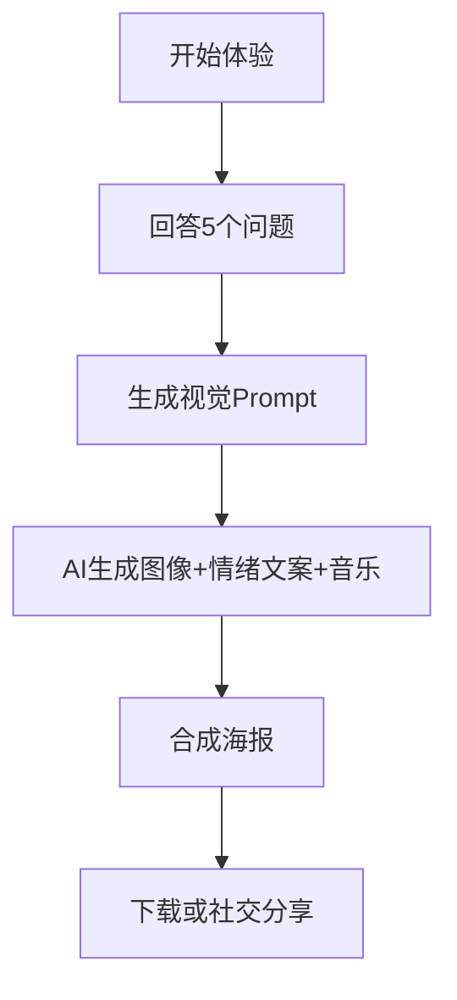

# 🕯️ The Last 24 Hours – AI视觉情绪生成器

>  一个为“世界末日前的情绪表达”而设计的 AI 生成器。通过5个简单问题生成专属画面、文字和音乐推荐，帮助用户在AIGC中找到自己情绪的投影。

---

## `🎬 项目简介`


本项目是一个 AIGC 个性化生成工具，用户只需回答 5 个简单问题，即可自动生成：

- ✨ 视觉图像（AI生成）
- 📝 文案描述（GPT生成）
- 🎵 背景音乐推荐（待开发）
- 🎞️ 情绪海报（视觉+文案融合）
  
---

## 🎨 产品亮点：
	•	用户0门槛体验个性化视觉生成
	•	以“末日前情绪”作为触发点，提供记忆、关系和自我投射的入口
	•	尝试将 AIGC 从炫技变成“情绪化叙事工具”

---

## 🧩 产品流程



**用户问题示例：**

* 你最想和谁共度最后的24小时？
* 你想在什么地方？
* 想听什么歌或旋律？
* 最近天气怎么样？
* 最后一句话你想说什么？

---

## **🛠️ 技术栈**

|  **模块**    |  **技术/平台**                    |
| --------------- | ------------------------------------ |
|  Prompt 编排  |  Python 自定义模板                 |
|  文生图       |  Stable Diffusion / Replicate API  |
|  文案生成     |  OpenAI GPT                        |
|  音乐推荐     |  情绪关键词匹配 or 简易推荐表      |
|  海报生成     |  Python PIL (Pillow)               |
|  前端展示     |  Streamlit（可选）                 |

---

## 📅 项目进度 Todo List

- [x] 项目立意：世界终结前24小时情绪生成器 💡
- [x] 构建 Prompt 自动拼接模块 ✍️
- [x] 接入 SDXL 模型，生成视觉图像 🖼️
- [x] 接入 OpenAI 文案生成 🎙️
- [x] 海报图像合成器（图+字融合）🎨
- [x] 一键运行主程序 main.py 🚀
- [x] 输出目录自动创建 & 保存 ✅
- [x] .env 配置环境变量 🧪
- [x] 项目结构优化 & 模块拆分 🧱
- [x] 高质量 README & 技术架构图 📘
- [ ] 📸 添加更多图像展示 / Demo 视频
- [ ] 📦 打包成 Web 界面（Gradio / Streamlit）
- [ ] 🌐 部署项目或制作网页版 Demo

---

## **🚀 快速开始（Quick Start）**

跟随以下步骤，一键启动你的「世界终结前24小时 · AI视觉体验生成器」：

### **1. 克隆项目**

```
git clone https://github.com/RyleHan/Last24hours-AI-Experience.git
cd Last24hours-AI-Experience
```

### **2. 安装依赖**

建议使用虚拟环境（如 **venv**）：

```
pip install -r requirements.txt
```

### **3. 配置环境变量** ****

### **.env**

项目依赖以下两个平台：

* 🔑 OpenAI API Key
* 🔑 Replicate API Token

创建 **.env** 文件，并填写如下内容（替换为你自己的 Token）：

```
OPENAI_API_KEY=你的OpenAI密钥
REPLICATE_API_TOKEN=你的Replicate密钥
```

### **4. 运行主程序**

```
python main.py
```

运行后，你将依次回答几个个性化问题（比如：你想和谁一起、在哪里、听什么歌），AI 会自动生成：

* 🎨 一张情绪海报图像（视觉图 + 文案）
* 🎧 背景音乐推荐（待开发）
* 💬 prompt展示（用于 AIGC 训练/优化）

输出文件默认保存在：

```
outputs/generated_poster.png
```

---

### **📌 补充说明**

* 支持 macOS / Windows / Linux
* 默认使用 SDXL 模型进行图像生成
* **如需更换模型，可修改 **image\_generator.py** 中的 **replicate.run(...)** 版本号**

---

## **📌 项目结构**

```
.
├── main.py                  # 一键入口
├── prompts/                 # Prompt 编排逻辑
├── generator/               # 文生图、文案和音乐模块
├── poster/                  # 海报合成逻辑
├── demo/                    # 测试代码
├── assets/                  # 示例图
├── outputs/                  # 自动生成的输出图
├── .env.example                  # API Key 模板
├── requirements.txt         # 依赖环境
└── README.md                # 本文件
```

---

## **👨‍💻 作者与定位**

该项目由 AI 产品经理实习申请人设计，强调 AIGC 能力、情绪理解、视觉审美与Prompt编排逻辑，适合作为产品作品集展示。

> 如果你看到这里，希望能一起交流AI产品或合作开发，请联系我 😄

